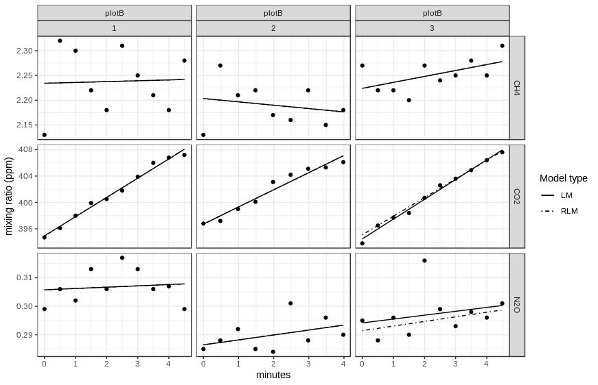

<!-- README.md is generated from README.Rmd. Please edit that file -->

```{r, echo = FALSE, message=FALSE}
knitr::opts_chunk$set(
  collapse = TRUE,
  comment = "#>",
  fig.path = "README-"
)
library(glimmr)
library(dplyr)
```

# glimmr <a href='https://tekknosol.github.io/glimmr/'></a>

**G**as F**l**uxes and Dynam**i**c Cha**m**ber **M**easu**R**ements

<!-- badges: start -->
[](https://www.tidyverse.org/lifecycle/#experimental)
[](https://travis-ci.org/tekknosol/glimmr)
<!-- badges: end -->

## Overview
The `glimmr` package provides functions to convert high frequency concentration data
obtained by (dynamic-) chamber measurements into gasfluxes. Data recorded with different devices can be processed automatically. The data is separated into chunks covering the single chamber applications and containing additional meta information (e.g. IDs, temperature...) provided by a metadata file.

Furthermore `glimmr` contains functions to calculate gasfluxes with the 'Boundary Layer Equation' (BLE). 

To calculate gasfluxes from high frequency chamber measurements, glimmr offers a cusomizable system of gas analyzer definitions (`analyzer()`), as well as two preconfigured devices with `read_`, `process_` and `inspect_` functions:

* `process_chamber()` & `inspect_chamber()`: custom devices
* `read_gasmet()`, `process_gasmet()` & `inspect_gasmet()`: GASMET
* `read_losgatos()`, `process_losgatos()` & `inspect_losgatos()`: LosGatos

## Installation

```{r, eval = FALSE}
# The package is not released on CRAN yet.
# Development version from GitHub:
# install.packages("devtools")
devtools::install_github("tekknosol/glimmr")
```

## Getting started
Calculate fluxes from device records and a meta file containing information about single measurements.
Fluxes are reported in [mmol/m²/d] using linear model fitting and robust linear model fitting with `robust::lmRob()`

```{r, eval = FALSE}
# read data
gasmet <- read_gasmet("path/to/gasmet_file.txt")
meta_gasmet <- read_csv("path/to/meta_file.csv")

# create diagnostic plot(s)
inspect_gasmet(gasmet, meta_gasmet)
```



```{r, cache=FALSE}
# compute fluxes in mmol/m²/d
# F_LM: Liner Model
# F_RLM: Robust Liner Model
process_gasmet(gasmet, meta_gasmet)
```


Calculate gas transfer coefficient used with the Boundary Layer Equation (BLE).

```{r}
# Windpseed in m/s
windspeed <- c(2, 4.3, 1.8) 
# Water temperature in °C
watertemperature <- c(18, 21, 19.3) 

# Calculate gas transfer coefficient
calc_kW(windspeed, watertemperature)
```
